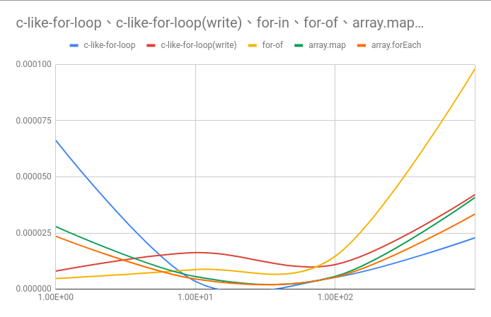
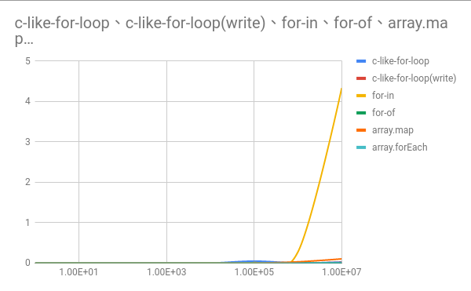

# js-loop-execution-time
某天我突發奇想，想知道在 nodejs 裡面各種迴圈哪一個速度較快，於是有了這個專案

# source code
[time](./src/time.ts)  
> 計算執行時間  

[json2csv](./src/json2csv)  
> 如其名  

[index](./src/index.ts)  
> 主程式  

# 結果
> [result.csv](./result/result.csv)

```csv
c-like-for-loop,c-like-for-loop(write),for-in,for-of,array.map,array.forEach
0.000066318,0.000008009,0.000008393,0.000004713,0.000027881,0.00002357
0.000003455,0.000016268,0.000007907,0.000008748,0.000005605,0.000004519
0.000005269,0.000010924,0.000023929,0.000014654,0.00000565,0.000005326
0.000022897,0.000042069,0.00037825,0.00009818,0.000040819,0.000033425
0.00021244,0.000408011,0.003003879,0.000710927,0.000347314,0.000287241
0.049075572,0.00017414,0.012804211,0.000226071,0.001025855,0.000113383
0.002799044,0.001708173,0.276469776,0.001143589,0.031578085,0.000562331
0.028009895,0.01704109,4.335750807,0.011334326,0.104906098,0.00558778
```


> 因為 for-in 會讓縱軸變太長，所以我拿掉了。



# 結論
原本我覺得 c-like-for-loop 應該會完勝其他方式，結果在 10 以內竟然會比較慢，幸好之後就正常了，另外比較另我訝異的是 for-in 的執行成本超高的，其他的時間成本都差不多，只要不要選 for-in 都沒什麼差。
